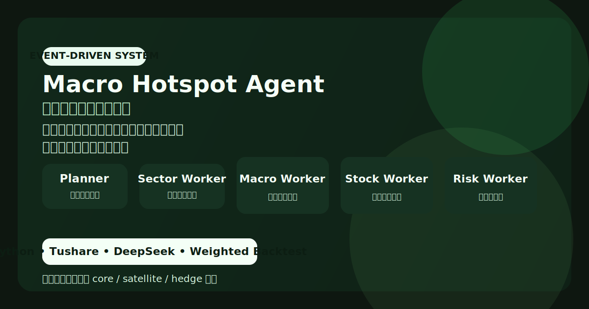
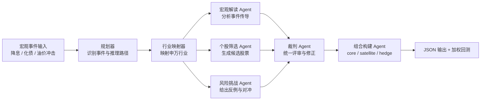

# 宏观热点选股多智能体（Macro Hotspot Agent）



这是一个围绕“宏观事件驱动选股”设计的多智能体项目。它的输入不是概念名，而是自然语言描述的宏观事件，例如 `美联储连续降息50bp`、`国内新一轮化债万亿`，输出则是可复查的组合研究结果。

## 项目定位

给定一个宏观事件后，系统会：

- 识别事件对应的推理路径
- 映射受益或受冲击的申万行业
- 并行完成宏观解读、个股筛选和风险挑战
- 让裁判 Agent 统一调整结论
- 生成 `core / satellite / hedge` 组合并做加权回测

## 为什么这个项目值得展示

- 它是事件驱动逻辑，而不是静态主题筛选器
- `hedge` 桶让它比普通选股 Demo 更接近真实研究框架
- 各 Agent 职责清晰，方便解释与审查
- 它是一个可运行的研究原型，而不是笔记本里的概念验证

## 架构图



## 流程说明

1. `planner` 解释宏观事件并选定推理路径。
2. `sector_worker` 将事件映射到可能受益或防御的行业。
3. `macro_worker`、`stock_worker`、`risk_worker` 并行运行。
4. `evidence_judge` 仲裁冲突意见并调整候选集。
5. `portfolio_builder` 根据桶位分配权重并准备回测输入。

## 与概念选股项目的区别

| 维度 | 概念选股多智能体 | 宏观热点选股多智能体 |
|---|---|---|
| 输入 | 概念名，如 `AI算力` | 宏观事件描述，如 `美联储降息50bp` |
| 候选池 | Tushare 概念板块成分股 | 申万一级行业 + 市值靠前股票 |
| 组合结构 | `core / satellite` | `core / satellite / hedge` |
| 回测方式 | 等权回测 | 分桶加权回测 |
| 核心重点 | 概念拆解与产业链逻辑 | 事件传导与交叉验证 |

## 技术栈

- `Python`
- `Tushare`：申万行业分类、日频市值等数据
- `DeepSeek`：多智能体推理引擎
- 本地 JSON 输出：保存可复查的研究结果

## 目录结构

```text
agents/      规划、行业映射、宏观解读、个股筛选、风险挑战、裁判等模块
data/        Tushare 与模型客户端
run.py       命令行入口
graph.py     流程编排
backtest.py  加权组合回测
config.py    模型与策略参数
```

## 安装

```bash
cd "/Users/xinwei/Desktop/my show/macro_hotspot_agent"
python3 -m venv .venv
source .venv/bin/activate
pip install -r requirements.txt
```

## 环境变量

请在本地创建 `.env`：

```bash
TUSHARE_TOKEN=your_tushare_token
DEEPSEEK_API_KEY=your_deepseek_key
```

## 使用方式

```bash
# 激活环境
source .venv/bin/activate

# 运行不同宏观事件
python run.py "美联储连续降息50bp"
python run.py "国内新一轮化债万亿"
python run.py "中东地缘冲突升级，油价飙升"
python run.py "碳中和政策加码"

# 自定义回测区间
python run.py "AI产业链景气度加速" --backtest-start 20240101 --backtest-end 20260414

# 跳过回测，只生成组合
python run.py "某个宏观事件" --skip-backtest
```

## 输出结果

每次运行会在 `outputs/` 下生成一份 JSON，通常包含：

- 事件解读
- 推理路径选择
- 行业映射结果
- 候选股票与推荐理由
- 风险检查与裁判调整
- 最终加权组合

命令行界面会打印组合结果、各桶权重以及回测摘要。

## 关键参数

主要参数位于 `config.py`：

- `PORTFOLIO_MAX_SIZE = 20`
- `STOCKS_PER_SECTOR_MIN` / `STOCKS_PER_SECTOR_MAX`
- `STOCKS_PER_INDUSTRY_IN_POOL = 8`
- `DEFAULT_REASONING_PATHS`
- `BENCHMARK = "000300.SH"`

## 设计说明

- 候选股票会先按行业和市值筛选，控制搜索空间
- `risk_worker` 独立存在，是为了强制系统生成反例与对冲视角
- 最终组合采用分桶加权，以体现不同置信度层级

## 后续可扩展方向

- 增加更丰富的事件模板和行业映射规则
- 支持更多基准对比
- 将裁判结论和风险笔记单独导出
- 支持多个宏观场景的批量评估
